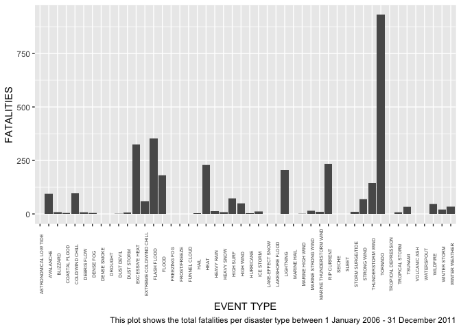
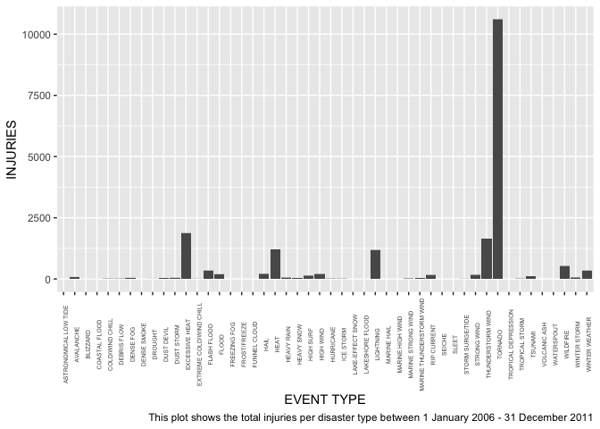
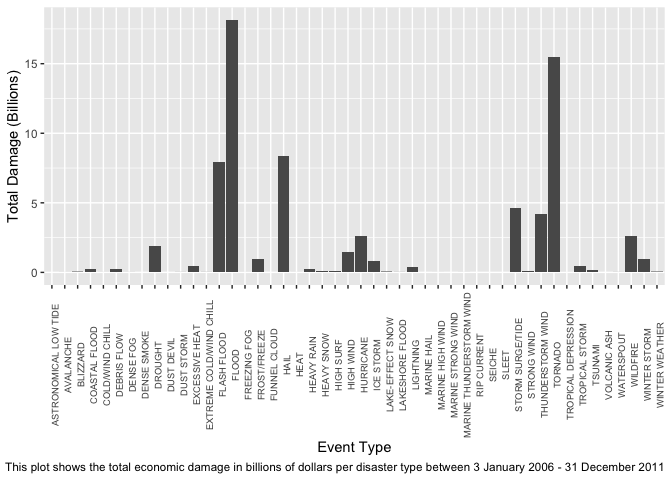

### Synopsis

In this study we discover the economic and health impacts disasters have on the US. By exploring the number of injuries and fatalities caused by each disaster type we can find out which had the largest health impact. And by exploring the crop and property damage we can find out which had the largest economic impact. With this data we found that tornados had the highest health impact, and floods, hail and tornados had the highest economic impact on the US. We used data from 2006 - 2011.

## Data Processing

### Loading and Processing the Raw Data

I obtained the data for this analysis from the [Reproducible Research course website](https://d396qusza40orc.cloudfront.net/repdata%2Fdata%2FStormData.csv.bz2) course website. The database tracks characteristics of major storms and weather events in the United States, including when and where they occur, as well as estimates of any fatalities, injuries, and property damage. The database included data from 1950 to 2011.


```r
file_url <- "https://d396qusza40orc.cloudfront.net/repdata%2Fdata%2FStormData.csv.bz2"
download.file(file_url, "my_data.bz2", method = "curl")
```

### Reading in the data

I read in the data directly using the read.csv function as this is able to read directly from the compressed bz2 file. 902297 observations of 37 variables are read into the my_data variable.


```r
my_data <- read.csv("my_data.bz2", stringsAsFactors = TRUE)
```

After reading in the data I check the first 6 rows and review the structure of the data using str and head functions.


```r
head(my_data)
```

```
##   STATE__           BGN_DATE BGN_TIME TIME_ZONE COUNTY COUNTYNAME STATE  EVTYPE
## 1       1  4/18/1950 0:00:00     0130       CST     97     MOBILE    AL TORNADO
## 2       1  4/18/1950 0:00:00     0145       CST      3    BALDWIN    AL TORNADO
## 3       1  2/20/1951 0:00:00     1600       CST     57    FAYETTE    AL TORNADO
## 4       1   6/8/1951 0:00:00     0900       CST     89    MADISON    AL TORNADO
## 5       1 11/15/1951 0:00:00     1500       CST     43    CULLMAN    AL TORNADO
## 6       1 11/15/1951 0:00:00     2000       CST     77 LAUDERDALE    AL TORNADO
##   BGN_RANGE BGN_AZI BGN_LOCATI END_DATE END_TIME COUNTY_END COUNTYENDN
## 1         0                                               0         NA
## 2         0                                               0         NA
## 3         0                                               0         NA
## 4         0                                               0         NA
## 5         0                                               0         NA
## 6         0                                               0         NA
##   END_RANGE END_AZI END_LOCATI LENGTH WIDTH F MAG FATALITIES INJURIES PROPDMG
## 1         0                      14.0   100 3   0          0       15    25.0
## 2         0                       2.0   150 2   0          0        0     2.5
## 3         0                       0.1   123 2   0          0        2    25.0
## 4         0                       0.0   100 2   0          0        2     2.5
## 5         0                       0.0   150 2   0          0        2     2.5
## 6         0                       1.5   177 2   0          0        6     2.5
##   PROPDMGEXP CROPDMG CROPDMGEXP WFO STATEOFFIC ZONENAMES LATITUDE LONGITUDE
## 1          K       0                                         3040      8812
## 2          K       0                                         3042      8755
## 3          K       0                                         3340      8742
## 4          K       0                                         3458      8626
## 5          K       0                                         3412      8642
## 6          K       0                                         3450      8748
##   LATITUDE_E LONGITUDE_ REMARKS REFNUM
## 1       3051       8806              1
## 2          0          0              2
## 3          0          0              3
## 4          0          0              4
## 5          0          0              5
## 6          0          0              6
```

```r
str(my_data)
```

```
## 'data.frame':	902297 obs. of  37 variables:
##  $ STATE__   : num  1 1 1 1 1 1 1 1 1 1 ...
##  $ BGN_DATE  : Factor w/ 16335 levels "1/1/1966 0:00:00",..: 6523 6523 4242 11116 2224 2224 2260 383 3980 3980 ...
##  $ BGN_TIME  : Factor w/ 3608 levels "00:00:00 AM",..: 272 287 2705 1683 2584 3186 242 1683 3186 3186 ...
##  $ TIME_ZONE : Factor w/ 22 levels "ADT","AKS","AST",..: 7 7 7 7 7 7 7 7 7 7 ...
##  $ COUNTY    : num  97 3 57 89 43 77 9 123 125 57 ...
##  $ COUNTYNAME: Factor w/ 29601 levels "","5NM E OF MACKINAC BRIDGE TO PRESQUE ISLE LT MI",..: 13513 1873 4598 10592 4372 10094 1973 23873 24418 4598 ...
##  $ STATE     : Factor w/ 72 levels "AK","AL","AM",..: 2 2 2 2 2 2 2 2 2 2 ...
##  $ EVTYPE    : Factor w/ 985 levels "   HIGH SURF ADVISORY",..: 834 834 834 834 834 834 834 834 834 834 ...
##  $ BGN_RANGE : num  0 0 0 0 0 0 0 0 0 0 ...
##  $ BGN_AZI   : Factor w/ 35 levels "","  N"," NW",..: 1 1 1 1 1 1 1 1 1 1 ...
##  $ BGN_LOCATI: Factor w/ 54429 levels ""," Christiansburg",..: 1 1 1 1 1 1 1 1 1 1 ...
##  $ END_DATE  : Factor w/ 6663 levels "","1/1/1993 0:00:00",..: 1 1 1 1 1 1 1 1 1 1 ...
##  $ END_TIME  : Factor w/ 3647 levels ""," 0900CST",..: 1 1 1 1 1 1 1 1 1 1 ...
##  $ COUNTY_END: num  0 0 0 0 0 0 0 0 0 0 ...
##  $ COUNTYENDN: logi  NA NA NA NA NA NA ...
##  $ END_RANGE : num  0 0 0 0 0 0 0 0 0 0 ...
##  $ END_AZI   : Factor w/ 24 levels "","E","ENE","ESE",..: 1 1 1 1 1 1 1 1 1 1 ...
##  $ END_LOCATI: Factor w/ 34506 levels ""," CANTON"," TULIA",..: 1 1 1 1 1 1 1 1 1 1 ...
##  $ LENGTH    : num  14 2 0.1 0 0 1.5 1.5 0 3.3 2.3 ...
##  $ WIDTH     : num  100 150 123 100 150 177 33 33 100 100 ...
##  $ F         : int  3 2 2 2 2 2 2 1 3 3 ...
##  $ MAG       : num  0 0 0 0 0 0 0 0 0 0 ...
##  $ FATALITIES: num  0 0 0 0 0 0 0 0 1 0 ...
##  $ INJURIES  : num  15 0 2 2 2 6 1 0 14 0 ...
##  $ PROPDMG   : num  25 2.5 25 2.5 2.5 2.5 2.5 2.5 25 25 ...
##  $ PROPDMGEXP: Factor w/ 19 levels "","-","?","+",..: 17 17 17 17 17 17 17 17 17 17 ...
##  $ CROPDMG   : num  0 0 0 0 0 0 0 0 0 0 ...
##  $ CROPDMGEXP: Factor w/ 9 levels "","?","0","2",..: 1 1 1 1 1 1 1 1 1 1 ...
##  $ WFO       : Factor w/ 542 levels ""," CI","%SD",..: 1 1 1 1 1 1 1 1 1 1 ...
##  $ STATEOFFIC: Factor w/ 250 levels "","ALABAMA, Central",..: 1 1 1 1 1 1 1 1 1 1 ...
##  $ ZONENAMES : Factor w/ 25112 levels "","                                                                                                               "| __truncated__,..: 1 1 1 1 1 1 1 1 1 1 ...
##  $ LATITUDE  : num  3040 3042 3340 3458 3412 ...
##  $ LONGITUDE : num  8812 8755 8742 8626 8642 ...
##  $ LATITUDE_E: num  3051 0 0 0 0 ...
##  $ LONGITUDE_: num  8806 0 0 0 0 ...
##  $ REMARKS   : Factor w/ 436781 levels "","\t","\t\t",..: 1 1 1 1 1 1 1 1 1 1 ...
##  $ REFNUM    : num  1 2 3 4 5 6 7 8 9 10 ...
```

I can see that some date columns are showing as factor data type, so I will correct these to be dates instead


```r
my_data$BGN_DATE <- strptime(my_data$BGN_DATE, format = "%m/%d/%Y", tz = "UTC")
my_data$END_DATE <- strptime(my_data$END_DATE, format = "%m/%d/%Y", tz = "UTC")
```

I noticed that some of the values in the EVTYPE column are showing up with incorrect values - for example instead of the event type e.g. THUNDERSTORM, it is showing "Summary June 6" 


```r
my_data[my_data$EVTYPE == "Summary June 6",]
```

```
##        STATE__   BGN_DATE    BGN_TIME TIME_ZONE COUNTY
## 270597      40 1996-06-06 02:05:00 PM       CST     18
##                                                  COUNTYNAME STATE
## 270597 OKZ018 - 023>024 - 027>030 - 032 - 040>042 - 044>047    OK
##                EVTYPE BGN_RANGE BGN_AZI BGN_LOCATI   END_DATE    END_TIME
## 270597 Summary June 6         0                    1996-06-06 09:45:00 PM
##        COUNTY_END COUNTYENDN END_RANGE END_AZI END_LOCATI LENGTH WIDTH  F MAG
## 270597          0         NA         0                         0     0 NA   0
##        FATALITIES INJURIES PROPDMG PROPDMGEXP CROPDMG CROPDMGEXP WFO
## 270597          0        0       0                  0            OUN
##                                      STATEOFFIC
## 270597 OKLAHOMA, Western, Central and Southeast
##                                                                                                                                                                     ZONENAMES
## 270597 KINGFISHER - KINGFISHER - CADDO - CANADIAN - GRADY - MCCLAIN - CLEVELAND - POTTAWATOMIE - HUGHES - GARVIN - MURRAY - PONTOTOC - COTTON - JEFFERSON - CARTER - JOHNSTON
##        LATITUDE LONGITUDE LATITUDE_E LONGITUDE_
## 270597        0         0          0          0
##                                                                                                                                                                                                                                                                                                                                                                                                                                                                                                                                                                                                                                                                                                                                                                                                                                                                                   REMARKS
## 270597 Severe thunderstorms moved through central and south-central Oklahoma during the afternoon and evening of June 6th.  An F0 tornado was observed by a spotter southeast of Wayne in McClain County. The largest hail fell in Dickson in Carter County, where hail as large as golf balls was reported. The strongest winds were estimated at 80 mph in Wynnewood in Garvin County, where at least one tree was downed.  \n\nStructural and tree damage due to severe thunderstorm winds was reported in Purcell and from Purcell to Dibble in McClain County and in Pauls Valley in Garvin County. Other more minor wind damage was reported in Kingfisher in Kingfisher County, near Concho in Canadian County, in Shawnee in Pottawatomie County, and west of Lamar in Hughes County. \n\nSee following individual Storm Data entries for additional reports and further details.
##        REFNUM
## 270597 270587
```

I will select data from 2006 - 2011 as this data appears to be well formatted and there is no particular need to have data from prior to 2006


```r
my_data_2006 <- my_data[my_data$BGN_DATE>"2006/01/01",]
```

Here's a check for NAs in the data:


```r
summary(is.na(my_data_2006))
```

```
##   STATE__         BGN_DATE        BGN_TIME       TIME_ZONE      
##  Mode :logical   Mode :logical   Mode :logical   Mode :logical  
##  FALSE:299138    FALSE:299138    FALSE:299138    FALSE:299138   
##                                                                 
##    COUNTY        COUNTYNAME        STATE           EVTYPE       
##  Mode :logical   Mode :logical   Mode :logical   Mode :logical  
##  FALSE:299138    FALSE:299138    FALSE:299138    FALSE:299138   
##                                                                 
##  BGN_RANGE        BGN_AZI        BGN_LOCATI       END_DATE      
##  Mode :logical   Mode :logical   Mode :logical   Mode :logical  
##  FALSE:299138    FALSE:299138    FALSE:299138    FALSE:299138   
##                                                                 
##   END_TIME       COUNTY_END      COUNTYENDN     END_RANGE        END_AZI       
##  Mode :logical   Mode :logical   Mode:logical   Mode :logical   Mode :logical  
##  FALSE:299138    FALSE:299138    TRUE:299138    FALSE:299138    FALSE:299138   
##                                                                                
##  END_LOCATI        LENGTH          WIDTH             F          
##  Mode :logical   Mode :logical   Mode :logical   Mode :logical  
##  FALSE:299138    FALSE:299138    FALSE:299138    FALSE:9303     
##                                                  TRUE :289835   
##     MAG          FATALITIES       INJURIES        PROPDMG       
##  Mode :logical   Mode :logical   Mode :logical   Mode :logical  
##  FALSE:299138    FALSE:299138    FALSE:299138    FALSE:299138   
##                                                                 
##  PROPDMGEXP       CROPDMG        CROPDMGEXP         WFO         
##  Mode :logical   Mode :logical   Mode :logical   Mode :logical  
##  FALSE:299138    FALSE:299138    FALSE:299138    FALSE:299138   
##                                                                 
##  STATEOFFIC      ZONENAMES        LATITUDE       LONGITUDE      
##  Mode :logical   Mode :logical   Mode :logical   Mode :logical  
##  FALSE:299138    FALSE:299138    FALSE:299091    FALSE:299138   
##                                  TRUE :47                       
##  LATITUDE_E      LONGITUDE_       REMARKS          REFNUM       
##  Mode :logical   Mode :logical   Mode :logical   Mode :logical  
##  FALSE:299098    FALSE:299138    FALSE:299138    FALSE:299138   
##  TRUE :40
```

We can see that only the columns F, LATITUDE & LATITUDE_E have some NAs and as we're not going to use these columns there is no need to remove or adjust for these observations.

If I run the unique command on the EVTYPE column, I get 54 unique event types instead of 48 event types which are showing in the [data pdf file](https://d396qusza40orc.cloudfront.net/repdata%2Fpeer2_doc%2Fpd01016005curr.pdf) in section 2.1.1


```r
unique(my_data_2006$EVTYPE)
```

```
##  [1] TORNADO                  TSTM WIND                HAIL                    
##  [4] FUNNEL CLOUD             FLASH FLOOD              EXCESSIVE HEAT          
##  [7] LIGHTNING                HIGH WIND                FLOOD                   
## [10] HEAVY RAIN               HEAVY SNOW               WINTER STORM            
## [13] STRONG WIND              DROUGHT                  BLIZZARD                
## [16] DUST DEVIL               THUNDERSTORM WIND        COASTAL FLOOD           
## [19] DENSE FOG                EXTREME COLD/WIND CHILL  AVALANCHE               
## [22] WINTER WEATHER           LANDSLIDE                WILDFIRE                
## [25] HIGH SURF                FROST/FREEZE             ICE STORM               
## [28] DUST STORM               WINTER WEATHER/MIX       HEAT                    
## [31] COLD/WIND CHILL          RIP CURRENT              TSUNAMI                 
## [34] TROPICAL STORM           STORM SURGE/TIDE         HEAVY SURF/HIGH SURF    
## [37] SLEET                    LAKE-EFFECT SNOW         STORM SURGE             
## [40] FREEZING FOG             DENSE SMOKE              SEICHE                  
## [43] LAKESHORE FLOOD          MARINE TSTM WIND         VOLCANIC ASH            
## [46] MARINE HAIL              WATERSPOUT               MARINE HIGH WIND        
## [49] MARINE THUNDERSTORM WIND MARINE STRONG WIND       ASTRONOMICAL LOW TIDE   
## [52] TROPICAL DEPRESSION      HURRICANE                VOLCANIC ASHFALL        
## 985 Levels:    HIGH SURF ADVISORY  COASTAL FLOOD  FLASH FLOOD ... WND
```

The following commands will merge some of the columns so that we have all the event types formatted in the same way and rename the landslide column to debris flow as this has been renamed in the same pdf as mentioned above.


```r
my_data_2006$EVTYPE <- as.character(my_data_2006$EVTYPE)

my_data_2006$EVTYPE[grepl("HEAVY SURF/HIGH SURF",my_data_2006$EVTYPE)] <- "HIGH SURF"
my_data_2006$EVTYPE[grepl("MARINE TSTM WIND",my_data_2006$EVTYPE)] <- "MARINE THUNDERSTORM WIND"
my_data_2006$EVTYPE[grepl("TSTM WIND",my_data_2006$EVTYPE)] <- "THUNDERSTORM WIND"
my_data_2006$EVTYPE[grepl("STORM SURGE",my_data_2006$EVTYPE)] <- "STORM SURGE/TIDE"
my_data_2006$EVTYPE[grepl("VOLCANIC ASHFALL",my_data_2006$EVTYPE)] <- "VOLCANIC ASH"
my_data_2006$EVTYPE[grepl("WINTER WEATHER/MIX",my_data_2006$EVTYPE)] <- "WINTER WEATHER"
my_data_2006$EVTYPE[grepl("LANDSLIDE",my_data_2006$EVTYPE)] <- "DEBRIS FLOW"

my_data_2006$EVTYPE <- as.factor(my_data_2006$EVTYPE)
```

Here are the results of a summary of the overall data points which are important.


```r
summary_data <- my_data_2006 %>%
  select(FATALITIES, INJURIES, PROPDMG, PROPDMGEXP, CROPDMG, CROPDMGEXP)
options(scipen = 999)
summary(summary_data)
```

```
##    FATALITIES           INJURIES            PROPDMG          PROPDMGEXP    
##  Min.   :  0.00000   Min.   :   0.0000   Min.   :   0.00   K      :266790  
##  1st Qu.:  0.00000   1st Qu.:   0.0000   1st Qu.:   0.00          : 29033  
##  Median :  0.00000   Median :   0.0000   Median :   0.00   M      :  3304  
##  Mean   :  0.01092   Mean   :   0.0644   Mean   :  11.86   B      :    10  
##  3rd Qu.:  0.00000   3rd Qu.:   0.0000   3rd Qu.:   1.20   0      :     1  
##  Max.   :158.00000   Max.   :1150.0000   Max.   :5000.00   -      :     0  
##                                                            (Other):     0  
##     CROPDMG          CROPDMGEXP    
##  Min.   :  0.000   K      :260451  
##  1st Qu.:  0.000          : 37983  
##  Median :  0.000   M      :   701  
##  Mean   :  1.817   B      :     3  
##  3rd Qu.:  0.000   ?      :     0  
##  Max.   :985.000   0      :     0  
##                    (Other):     0
```

We can see that PROPDMGEXP & CROPDMGEXP have some values for K, M, B for example which means that we need to multiply the respective column e.g. PROPDMG by that amount.


```r
unique(my_data_2006$PROPDMGEXP)
```

```
## [1]   K M B 0
## Levels:  - ? + 0 1 2 3 4 5 6 7 8 B h H K m M
```

```r
unique(my_data_2006$CROPDMGEXP)
```

```
## [1]   K M B
## Levels:  ? 0 2 B k K m M
```


```r
my_data_2006$PROPDMGEXP <- as.character(my_data_2006$PROPDMGEXP)
my_data_2006$CROPDMGEXP <- as.character(my_data_2006$CROPDMGEXP)

my_data_2006$PROPDMGEXP[grepl("^$",my_data_2006$PROPDMGEXP)] <- 1
my_data_2006$PROPDMGEXP[grepl("K",my_data_2006$PROPDMGEXP)] <- 1000
my_data_2006$PROPDMGEXP[grepl("M",my_data_2006$PROPDMGEXP)] <- 1000000
my_data_2006$PROPDMGEXP[grepl("B",my_data_2006$PROPDMGEXP)] <- 1000000000

my_data_2006$CROPDMGEXP[grepl("^$",my_data_2006$CROPDMGEXP)] <- 1
my_data_2006$CROPDMGEXP[grepl("K",my_data_2006$CROPDMGEXP)] <- 1000
my_data_2006$CROPDMGEXP[grepl("M",my_data_2006$CROPDMGEXP)] <- 1000000
my_data_2006$CROPDMGEXP[grepl("B",my_data_2006$CROPDMGEXP)] <- 1000000000

my_data_2006$PROPDMGEXP <- as.numeric(my_data_2006$PROPDMGEXP)
my_data_2006$CROPDMGEXP <- as.numeric(my_data_2006$CROPDMGEXP)

my_data_2006$PROPDMG <- my_data_2006$PROPDMG * my_data_2006$PROPDMGEXP
my_data_2006$CROPDMG <- my_data_2006$CROPDMG * my_data_2006$CROPDMGEXP
```

## Results

### Across the United States, which types of events are most harmful with respect to population health?

Here I will list out the top 10 event types with the most fatalities and most injuries from 2006 - 2011


```r
total_health_effect_per_type <- my_data_2006 %>%
  group_by(EVTYPE) %>%
  summarise(total_fatalities = sum(FATALITIES), total_injuries = sum(INJURIES)) %>%
  arrange(desc(total_fatalities))
```

```
## `summarise()` ungrouping output (override with `.groups` argument)
```

```r
total_health_effect_per_type[1:10,]
```

```
## # A tibble: 10 x 3
##    EVTYPE            total_fatalities total_injuries
##    <fct>                        <dbl>          <dbl>
##  1 TORNADO                        930          10600
##  2 FLASH FLOOD                    352            334
##  3 EXCESSIVE HEAT                 324           1873
##  4 RIP CURRENT                    233            151
##  5 HEAT                           229           1222
##  6 LIGHTNING                      204           1168
##  7 FLOOD                          180            176
##  8 THUNDERSTORM WIND              143           1632
##  9 COLD/WIND CHILL                 95             12
## 10 AVALANCHE                       94             63
```

```r
total_health_effect_per_type <- total_health_effect_per_type %>%
  arrange(desc(total_injuries))
total_health_effect_per_type[1:10,]
```

```
## # A tibble: 10 x 3
##    EVTYPE            total_fatalities total_injuries
##    <fct>                        <dbl>          <dbl>
##  1 TORNADO                        930          10600
##  2 EXCESSIVE HEAT                 324           1873
##  3 THUNDERSTORM WIND              143           1632
##  4 HEAT                           229           1222
##  5 LIGHTNING                      204           1168
##  6 WILDFIRE                        45            517
##  7 WINTER WEATHER                  33            346
##  8 FLASH FLOOD                    352            334
##  9 HAIL                             2            198
## 10 HIGH WIND                       48            191
```

We can see that tornado appears to have the highest health affect on the population with the most number of injuries and fatalities.

Let's take a look at the top 10 specific events with the most fatalities


```r
total_health_effect_per_type <- my_data_2006 %>%
  group_by(EVTYPE, BGN_DATE) %>%
  summarise(total_fatalities = sum(FATALITIES), total_injuries = sum(INJURIES)) %>%
  arrange(desc(total_fatalities))
```

```
## `summarise()` regrouping output by 'EVTYPE' (override with `.groups` argument)
```

```r
total_health_effect_per_type[1:10,]
```

```
## # A tibble: 10 x 4
## # Groups:   EVTYPE [3]
##    EVTYPE         BGN_DATE            total_fatalities total_injuries
##    <fct>          <dttm>                         <dbl>          <dbl>
##  1 TORNADO        2011-04-27 00:00:00              344           3210
##  2 TORNADO        2011-05-22 00:00:00              159           1221
##  3 EXCESSIVE HEAT 2006-08-01 00:00:00               99            145
##  4 EXCESSIVE HEAT 2006-07-16 00:00:00               53             18
##  5 TORNADO        2008-02-05 00:00:00               48            371
##  6 TSUNAMI        2009-09-29 00:00:00               32            129
##  7 TORNADO        2006-04-02 00:00:00               27            348
##  8 TORNADO        2011-04-16 00:00:00               26            480
##  9 TORNADO        2008-05-10 00:00:00               22            375
## 10 TORNADO        2007-02-02 00:00:00               21            118
```

We can see that in 2011 there were some events with an extremely large number of fatalities and injuries for Tornadoes.

Let's remove 2011 from the data and see if tornado type events still have the largest effect on health.


```r
my_data_2006_2010 <- my_data_2006[my_data_2006$BGN_DATE<"2010/12/31",]

total_health_effect_per_type_2010 <- my_data_2006_2010 %>%
  group_by(EVTYPE) %>%
  summarise(total_fatalities = sum(FATALITIES), total_injuries = sum(INJURIES)) %>%
  arrange(desc(total_fatalities))
```

```
## `summarise()` ungrouping output (override with `.groups` argument)
```

```r
total_health_effect_per_type_2010[1:10,]
```

```
## # A tibble: 10 x 3
##    EVTYPE            total_fatalities total_injuries
##    <fct>                        <dbl>          <dbl>
##  1 TORNADO                        334           4408
##  2 EXCESSIVE HEAT                 288           1735
##  3 FLASH FLOOD                    284            304
##  4 RIP CURRENT                    204            124
##  5 LIGHTNING                      178            974
##  6 HEAT                           166            611
##  7 FLOOD                          122            166
##  8 THUNDERSTORM WIND               89           1259
##  9 AVALANCHE                       85             55
## 10 COLD/WIND CHILL                 74             11
```

```r
total_health_effect_per_type_2010 <- total_health_effect_per_type_2010 %>%
  arrange(desc(total_injuries))
total_health_effect_per_type_2010[1:10,]
```

```
## # A tibble: 10 x 3
##    EVTYPE            total_fatalities total_injuries
##    <fct>                        <dbl>          <dbl>
##  1 TORNADO                        334           4408
##  2 EXCESSIVE HEAT                 288           1735
##  3 THUNDERSTORM WIND               89           1259
##  4 LIGHTNING                      178            974
##  5 HEAT                           166            611
##  6 WILDFIRE                        39            401
##  7 WINTER WEATHER                  31            346
##  8 FLASH FLOOD                    284            304
##  9 HIGH WIND                       44            180
## 10 HAIL                             2            167
```

Tornados still appear to have the highest number of injuries and fatalities, even when removing 2011. Let's take a look at a plot of the different event types. 


```r
ggplot(my_data_2006, aes(EVTYPE, FATALITIES)) + geom_bar(stat = "identity") +
  theme(axis.text.x = element_text(angle = 90, size=5)) +
  labs(x = "EVENT TYPE", caption = "This plot shows the total fatalities per disaster type between 1 January 2006 - 31 December 2011")
```

<!-- -->

```r
ggplot(my_data_2006, aes(EVTYPE, INJURIES)) + geom_bar(stat = "identity") +
  theme(axis.text.x = element_text(angle = 90, size=5)) +
  labs(x = "EVENT TYPE", caption = "This plot shows the total injuries per disaster type between 1 January 2006 - 31 December 2011")
```

<!-- -->

These plots also show that Tornados have a higher number of injuries and fatalities. Heat type events such as excessive heat appear to have a high number of fatalities and injuries on average while water based events such as floods and rip current have a high number of fatalities and with a relatively lower number of injuries.

### Across the United States, which types of events have the greatest economic consequences?

First let's see the total economic effect on all sources together, so I have merged the property and crop damaage data with the following code


```r
total_economic_effect_per_type <- my_data_2006 %>%
  group_by(EVTYPE) %>%
  summarise(Total_Damage = sum(PROPDMG, CROPDMG)) %>%
  arrange(desc(Total_Damage))
```

```
## `summarise()` ungrouping output (override with `.groups` argument)
```

```r
total_economic_effect_per_type[1:10,]
```

```
## # A tibble: 10 x 2
##    EVTYPE            Total_Damage
##    <fct>                    <dbl>
##  1 FLOOD             133466686240
##  2 TORNADO            15491243740
##  3 HAIL                8401297600
##  4 FLASH FLOOD         7914222260
##  5 STORM SURGE/TIDE    4642198000
##  6 THUNDERSTORM WIND   4210441770
##  7 DROUGHT             2924635000
##  8 HURRICANE           2648110000
##  9 WILDFIRE            2633304870
## 10 HIGH WIND           1430802140
```

We can see that flood damage has an extremely high value, let's look again for any other outlying data. The next code will show us the events which caused the most damage to crop and property damage.


```r
total_economic_effect_per_type_event <- my_data_2006 %>%
  group_by(EVTYPE, BGN_DATE) %>%
  summarise(total_propdmg = sum(PROPDMG), total_cropdmg = sum(CROPDMG)) %>%
  arrange(desc(total_propdmg))
```

```
## `summarise()` regrouping output by 'EVTYPE' (override with `.groups` argument)
```

```r
total_economic_effect_per_type_event[1:10,]
```

```
## # A tibble: 10 x 4
## # Groups:   EVTYPE [6]
##    EVTYPE           BGN_DATE            total_propdmg total_cropdmg
##    <fct>            <dttm>                      <dbl>         <dbl>
##  1 FLOOD            2006-01-01 00:00:00  115285355000      35500000
##  2 TORNADO          2011-04-27 00:00:00    4646769000       9870000
##  3 STORM SURGE/TIDE 2008-09-12 00:00:00    4575255000             0
##  4 FLOOD            2011-05-01 00:00:00    3439655000     110745000
##  5 TORNADO          2011-05-22 00:00:00    3020921000             0
##  6 HAIL             2010-10-05 00:00:00    2810010000             0
##  7 FLOOD            2011-08-28 00:00:00    2635771000      13450000
##  8 FLOOD            2010-05-01 00:00:00    2058180000         40000
##  9 HURRICANE        2008-09-12 00:00:00    1818000000      25000000
## 10 FLASH FLOOD      2006-06-27 00:00:00    1214106000             0
```

```r
total_economic_effect_per_type_event <- total_economic_effect_per_type_event %>%
    arrange(desc(total_cropdmg))
total_economic_effect_per_type_event[1:10,]
```

```
## # A tibble: 10 x 4
## # Groups:   EVTYPE [4]
##    EVTYPE         BGN_DATE            total_propdmg total_cropdmg
##    <fct>          <dttm>                      <dbl>         <dbl>
##  1 FLOOD          2010-06-12 00:00:00       5491100    1040413000
##  2 DROUGHT        2006-01-01 00:00:00      15000000    1000750000
##  3 FLOOD          2007-07-01 00:00:00      46059000     503050000
##  4 EXCESSIVE HEAT 2006-07-16 00:00:00        170000     492400000
##  5 DROUGHT        2007-09-01 00:00:00             0     370000000
##  6 FLOOD          2008-06-01 00:00:00    1038770000     352186000
##  7 FROST/FREEZE   2010-01-10 00:00:00       3020000     306000000
##  8 FLOOD          2008-06-04 00:00:00     215535500     300885000
##  9 DROUGHT        2006-02-01 00:00:00         25000     300500000
## 10 DROUGHT        2006-07-01 00:00:00         50000     235750000
```

Let's re-run the total damage again, removing the 1st & 2nd of January 2006 as this has extreme data.


```r
my_data_2006_2_1_2006 <- my_data_2006[my_data_2006$BGN_DATE>"2006/01/02",]

total_economic_effect_per_type <- my_data_2006_2_1_2006 %>%
  group_by(EVTYPE) %>%
  summarise(Total_Damage = sum(PROPDMG, CROPDMG)) %>%
  arrange(desc(Total_Damage))
```

```
## `summarise()` ungrouping output (override with `.groups` argument)
```

```r
total_economic_effect_per_type[1:10,]
```

```
## # A tibble: 10 x 2
##    EVTYPE            Total_Damage
##    <fct>                    <dbl>
##  1 FLOOD              18145831240
##  2 TORNADO            15491143740
##  3 HAIL                8401297600
##  4 FLASH FLOOD         7914212260
##  5 STORM SURGE/TIDE    4642198000
##  6 THUNDERSTORM WIND   4210441770
##  7 HURRICANE           2648110000
##  8 WILDFIRE            2619454870
##  9 DROUGHT             1908885000
## 10 HIGH WIND           1430160140
```


```r
ggplot(total_economic_effect_per_type, aes(EVTYPE, Total_Damage/1000000000)) + geom_bar(stat = "identity") +
  theme(axis.text.x = element_text(angle = 90, size=7)) +
  labs(x = "Event Type", y = "Total Damage (Billions)", caption = "This plot shows the total economic damage in billions of dollars per disaster type between 3 January 2006 - 31 December 2011")
```

<!-- -->

We can see that floods, tornados and hail have caused the most amount of economic damage.

## Conclusion

Floods, tornados and hail have the highest economic impact between 2006 and 2011.
Tornados have the highest health impact between 2006 and 2011
